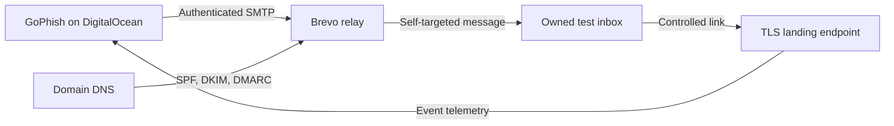

# GoPhish Phishing Simulation & Email Security Lab

An authorized, self-targeted phishing-simulation project built to study the phishing lifecycle, email authentication, secure infrastructure, and defensive detection opportunities.

> **Ethical-use notice:** This repository documents a controlled cybersecurity lab performed with infrastructure, domains, and recipient accounts owned by the operator. It does not include real credentials, reusable branded login clones, secrets, or instructions for targeting third parties.

## Project Overview

I originally completed this project in June 2026 using a DigitalOcean VPS, GoPhish, a personally owned domain, Brevo SMTP, and a TLS certificate. I configured SPF, DKIM, and DMARC, built controlled Microsoft- and Google-inspired scenarios, sent campaigns only to accounts I controlled, and analyzed the resulting campaign lifecycle.

I later adapted the project into a simpler classroom workflow using Kali Linux and Gmail SMTP. This repository documents both versions:

| Implementation | Purpose | Infrastructure | SMTP | Exposure |
|---|---|---|---|---|
| [VPS + Brevo + domain](docs/vps-brevo-domain-guide.md) | Original portfolio implementation | DigitalOcean VPS, domain, reverse proxy, TLS | Brevo | Public landing endpoint; admin interface restricted |
| [Kali + Gmail self-test](docs/kali-gmail-self-test-guide.md) | Beginner classroom version | Local Kali VM | Dedicated Gmail account | Local-only landing page |

## Objectives

- Deploy and securely administer GoPhish in a controlled environment.
- Configure a personally owned sending domain and authenticated SMTP relay.
- Implement and validate SPF, DKIM, and DMARC.
- Create controlled social-engineering scenarios without collecting real credentials.
- Observe delivery, click, and dummy-submission events.
- Map the simulation to defensive controls and detection opportunities.
- Document a repeatable, beginner-friendly version for cybersecurity students.

## Original Architecture



The GoPhish administration interface was not intended for public access. The public-facing component was limited to the controlled landing endpoint, while administrative access was restricted and protected separately.

## Email Authentication

| Control | Role in the lab | Defensive value |
|---|---|---|
| SPF | Authorized the approved sending service for the lab domain | Helps receiving systems evaluate permitted senders |
| DKIM | Added a cryptographic signature to messages | Helps verify message integrity and domain association |
| DMARC | Defined alignment and reporting policy | Provides policy enforcement and visibility into domain abuse |
| TLS | Protected browser traffic to the controlled landing endpoint | Prevents cleartext transport of test interactions |

SPF, DKIM, and DMARC improve sender authentication, but they do not prove that message content is harmless. A legitimate domain can still send a deceptive message, which is why layered filtering, user awareness, browser protections, and incident reporting remain important.

## Repository Structure

```text
gophish-phishing-simulation-lab/
├── README.md
├── DISCLAIMER.md
├── LICENSE
├── SECURITY.md
├── .gitignore
├── docs/
│   ├── architecture.md
│   ├── findings-and-defenses.md
│   ├── kali-gmail-self-test-guide.md
│   └── vps-brevo-domain-guide.md
├── examples/
│   └── config.example.json
└── templates/
    ├── fictional-training-email.html
    └── fictional-training-page.html
```

## Project Workflow

1. Defined a self-targeted authorization boundary.
2. Provisioned the VPS and hardened administrative access.
3. Installed and configured GoPhish.
4. Connected a personally owned domain to the lab.
5. Configured Brevo as the authenticated SMTP relay.
6. Published and validated SPF, DKIM, and DMARC.
7. Added TLS to the controlled landing endpoint.
8. Created controlled email and landing-page scenarios.
9. Executed campaigns only against owned test accounts.
10. Reviewed delivery, click, submission, and timeline events.
11. Identified defensive controls across email, DNS, web, identity, and user reporting.

## What I Analyzed

- How sender authentication affects message trust and delivery.
- How users encounter a link-based phishing workflow.
- Which events GoPhish records during a campaign.
- Why open tracking is less reliable than click and submission events.
- How mail gateways, DNS records, browser controls, and user reporting disrupt the phishing lifecycle.
- Why authentication controls must be combined with content analysis and security awareness.

See [Findings and Defensive Opportunities](docs/findings-and-defenses.md) for the complete analysis.

## Skills Demonstrated

- GoPhish deployment and administration
- DigitalOcean VPS provisioning
- Linux and SSH administration
- DNS configuration and validation
- SPF, DKIM, and DMARC
- SMTP relay integration with Brevo and Gmail
- TLS certificate deployment
- Security-focused documentation
- Phishing lifecycle analysis
- Detection and mitigation mapping
- Ethical scoping and data handling

## Limitations

- The original project was a small self-test, not an enterprise phishing-awareness program.
- Email-open telemetry may be distorted by blocked images or privacy proxies.
- SPF, DKIM, and DMARC validation varies by receiver and forwarding path.
- The public repository uses fictional, clearly labeled templates rather than reusable copies of real login pages.
- No real passwords, MFA codes, recovery codes, or personal information were collected.

## Future Improvements

- Send GoPhish events into a SIEM and create detection dashboards.
- Compare headers from authenticated and deliberately misconfigured lab messages.
- Add automated DNS validation for SPF, DKIM, and DMARC.
- Document mail-gateway detections and browser warnings.
- Create a defender-focused incident-response exercise around reported messages.

## Responsible Use

Only use GoPhish with written authorization, controlled infrastructure, and recipients who are explicitly within scope. The maintainers of GoPhish and the services referenced here have their own terms and acceptable-use requirements. Read [DISCLAIMER.md](DISCLAIMER.md) before reproducing any portion of this lab.

