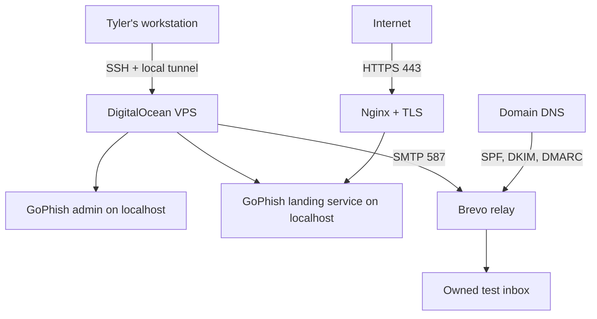
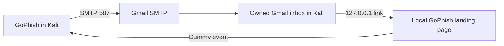

# Architecture and Security Boundaries

## Original VPS Deployment

### Trust Boundaries

| Boundary | Control |
|---|---|
| Workstation to VPS | SSH key authentication and restricted source IP |
| Administrator to GoPhish | Local SSH tunnel; admin service bound to localhost |
| Internet to landing service | Nginx reverse proxy and TLS |
| GoPhish to SMTP relay | Authenticated SMTP with a revocable Brevo key |
| Sending domain to receiving service | SPF authorization, DKIM signing, and DMARC alignment policy |
| Campaign to recipient | Owned recipient account and documented self-test scope |

### Exposed Services

| Port | Service | Intended exposure |
|---|---|---|
| 22/TCP | SSH | Restricted to administrator source IP where practical |
| 80/TCP | HTTP | Temporary redirect and certificate issuance |
| 443/TCP | HTTPS landing endpoint | Public during the controlled test |
| 3333/TCP | GoPhish admin | Localhost only; accessed through SSH tunnel |
| 8080/TCP | GoPhish landing backend | Localhost only; reached through Nginx |

## Classroom Kali Deployment

The classroom version reduces the attack surface by keeping the landing endpoint local to the Kali VM. Its tradeoff is that the email must be opened inside that VM, and Gmail can filter or restrict simulated phishing messages.

## Data Classification

| Data | Handling requirement |
|---|---|
| SMTP passwords and API keys | Password manager only; never committed |
| GoPhish database | Local sensitive artifact; excluded from Git |
| Recipient addresses | Redact from public screenshots and documentation |
| Campaign IDs and tracking links | Redact before publication |
| Dummy training codes | Non-sensitive, but delete after the lab |
| Real passwords or MFA codes | Never collect or enter |

## Design Decisions

1. **Local-only administration:** The GoPhish admin console has no reason to be public.
2. **Reverse proxy separation:** Nginx terminates TLS while GoPhish stays on a local backend port.
3. **Dedicated domain and SMTP identity:** Lab traffic is separated from school, work, and personal production accounts.
4. **Revocable credentials:** App Passwords and SMTP keys can be removed immediately after testing.
5. **Minimal targets:** A one-recipient self-test limits accidental distribution and unnecessary data collection.
6. **Fictional templates:** Public examples teach the workflow without publishing reusable real-brand clones.

