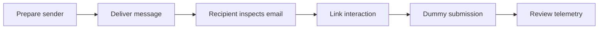

# Findings and Defensive Opportunities

## Phishing Lifecycle Observed

The lab demonstrated that a phishing campaign is a chain of dependencies rather than a single email. Defenders can interrupt the activity at the domain, mail, browser, identity, endpoint, network, or user-reporting layer.

## Key Findings

### 1. Authentication is not the same as trust

SPF, DKIM, and DMARC help a recipient verify sending authorization and alignment. They do not prove that the content or requested action is safe. A message can authenticate successfully and still use urgency, impersonation, or a deceptive link.

### 2. Link destination matters

Display text can appear familiar while the destination belongs to a different host. Security-awareness training should teach users to inspect the actual destination and report unexpected authentication requests.

### 3. Open tracking is imperfect

Remote images may be blocked, cached, or loaded by privacy services. An “opened” event should not be treated as definitive evidence that a person read the message.

### 4. Click and submission events are stronger signals

For this lab, a controlled link click and dummy-code submission provided clearer evidence that the workflow functioned. No real credentials were required to demonstrate the risk.

### 5. Administrative isolation is essential

The campaign landing service may need to be reachable, but the GoPhish administrative console should not be internet-facing. Binding it to localhost and using an SSH tunnel reduces unnecessary exposure.

## Defensive Opportunities

| Layer | Detection or prevention opportunity |
|---|---|
| DNS | Monitor newly registered and look-alike domains; enforce protective DNS |
| Email authentication | Evaluate SPF, DKIM, and DMARC alignment and policy |
| Secure email gateway | Analyze sender reputation, content, attachments, and URLs |
| Browser | Use reputation services, safe browsing, and isolation where appropriate |
| Identity | Require phishing-resistant MFA and detect anomalous sign-ins |
| Endpoint | Detect suspicious browser-to-process or download behavior |
| Network | Log DNS and proxy activity involving unusual domains |
| User awareness | Teach link inspection and reward rapid reporting |
| Incident response | Quarantine messages, block indicators, review accounts, and notify users |

## ATT&CK Context

The controlled scenario most closely resembles:

- **T1566.002 — Phishing: Spearphishing Link**
- **T1204.001 — User Execution: Malicious Link**

The lab simulated these behaviors for defensive learning. It did not deliver malware or collect real credentials.

## Useful Evidence to Collect

- Redacted message headers showing authentication results
- DNS lookups for SPF, DKIM, and DMARC
- Redacted GoPhish timeline events
- TLS certificate details for the lab subdomain
- Firewall rules proving the admin port was not public
- A diagram of the sender, relay, recipient, and landing endpoint
- Cleanup evidence showing keys revoked and infrastructure removed

## Limitations

- A small self-test cannot measure organization-wide user behavior.
- Gmail and other providers may block, rewrite, or proxy content.
- DMARC policy changes require observation over time before enforcement.
- Results depend on the receiving service and its security controls.
- GoPhish telemetry should be correlated with mail, DNS, proxy, identity, and endpoint logs for a fuller picture.

## Next Defensive Iteration

A strong follow-up project would forward GoPhish, Nginx, and mail-event data into a SIEM. Detection rules could then alert on the lab domain, unique URL path, DNS request, proxy request, or dummy-submission event. The final deliverable could compare campaign telemetry with defender visibility and document which controls detected each stage.

