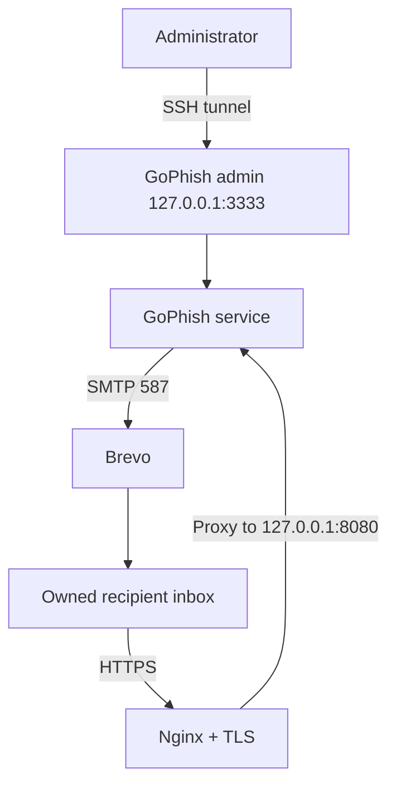

# Step-by-Step Guide: DigitalOcean, Brevo, Domain, and TLS

This guide reconstructs the architecture used for the original portfolio project. It is intentionally limited to an authorized, self-targeted exercise. Use only infrastructure, domains, sender identities, and recipient accounts you own.

## 1. Define the Scope

Before provisioning anything, write down the authorization boundary:

- One personally owned VPS
- One personally owned domain or delegated lab subdomain
- One Brevo account authorized to send for that domain
- One or two recipient accounts owned by the tester
- Fictional branding and dummy form data only
- No real password, MFA code, recovery code, student ID, or personal information
- No third-party targets

Record the start date, end date, allowed sender addresses, allowed recipients, and cleanup plan.

## 2. Architecture



The public network should never expose the GoPhish admin console directly. Only the controlled landing endpoint should be reachable through HTTPS.

## 3. Provision the VPS

Create a small Ubuntu or Debian VPS in DigitalOcean. Use SSH keys instead of password authentication when possible.

Connect from your workstation:

```bash
ssh root@VPS_IP
```

Create a non-root administrator and update the host:

```bash
adduser labadmin
usermod -aG sudo labadmin
apt update
apt upgrade -y
```

Reconnect as the new user before continuing:

```bash
ssh labadmin@VPS_IP
```

## 4. Apply Basic Host Controls

Install required packages:

```bash
sudo apt install -y curl unzip nginx ufw
```

Allow only the services required by the lab:

```bash
sudo ufw allow OpenSSH
sudo ufw allow 80/tcp
sudo ufw allow 443/tcp
sudo ufw enable
sudo ufw status
```

Do not open the GoPhish admin port to the internet. Restrict DigitalOcean Cloud Firewall rules in the same way and limit SSH to your own source IP when practical.

## 5. Connect the Lab Domain

Create a dedicated subdomain such as:

```text
training.example-lab.com
```

At your DNS provider, create an `A` record pointing the subdomain to the VPS public IP. Do not reuse a production website or business domain.

Validate resolution:

```bash
dig +short training.example-lab.com
```

DNS changes can take time to propagate.

## 6. Install GoPhish

Open the official GoPhish releases page and identify the current Linux 64-bit release. Download only from the official GitHub repository.

Example workflow:

```bash
mkdir -p ~/gophish
cd ~/gophish
curl -L "OFFICIAL_RELEASE_ZIP_URL" -o gophish.zip
unzip gophish.zip
chmod +x gophish
ls -la
```

Do not blindly reuse a version URL from an old tutorial. Confirm the release and file name on the official release page first.

## 7. Configure Local Service Bindings

Back up the configuration:

```bash
cp config.json config.json.backup
nano config.json
```

Keep the admin service bound to localhost and place the landing service behind Nginx:

```json
{
  "admin_server": {
    "listen_url": "127.0.0.1:3333",
    "use_tls": true,
    "cert_path": "gophish_admin.crt",
    "key_path": "gophish_admin.key",
    "trusted_origins": []
  },
  "phish_server": {
    "listen_url": "127.0.0.1:8080",
    "use_tls": false,
    "cert_path": "example.crt",
    "key_path": "example.key"
  },
  "db_name": "sqlite3",
  "db_path": "gophish.db",
  "migrations_prefix": "db/db_"
}
```

Validate the JSON:

```bash
python3 -m json.tool config.json >/dev/null && echo "Configuration is valid"
```

## 8. Run GoPhish as a Service

First launch it manually and confirm it works:

```bash
cd ~/gophish
./gophish
```

Copy the temporary administrator password into a password manager. Stop the process with `Ctrl+C` after the initial test.

Create a systemd unit only after confirming the paths and user:

```ini
[Unit]
Description=GoPhish authorized lab service
After=network.target

[Service]
Type=simple
User=labadmin
WorkingDirectory=/home/labadmin/gophish
ExecStart=/home/labadmin/gophish/gophish
Restart=on-failure

[Install]
WantedBy=multi-user.target
```

Save it as `/etc/systemd/system/gophish.service`, then run:

```bash
sudo systemctl daemon-reload
sudo systemctl enable --now gophish
sudo systemctl status gophish --no-pager
```

## 9. Access the Admin Console Safely

Create an SSH tunnel from your workstation:

```bash
ssh -L 3333:127.0.0.1:3333 labadmin@VPS_IP
```

Then open:

```text
https://127.0.0.1:3333
```

The default administrative certificate is self-signed. Confirm that you are connecting through your own SSH tunnel before accepting the local warning. Change the temporary administrator password immediately.

## 10. Configure Nginx for the Landing Endpoint

Create `/etc/nginx/sites-available/gophish-lab`:

```nginx
server {
    listen 80;
    server_name training.example-lab.com;

    location / {
        proxy_pass http://127.0.0.1:8080;
        proxy_set_header Host $host;
        proxy_set_header X-Real-IP $remote_addr;
        proxy_set_header X-Forwarded-For $proxy_add_x_forwarded_for;
        proxy_set_header X-Forwarded-Proto $scheme;
    }
}
```

Enable and test it:

```bash
sudo ln -s /etc/nginx/sites-available/gophish-lab /etc/nginx/sites-enabled/gophish-lab
sudo nginx -t
sudo systemctl reload nginx
```

## 11. Add a TLS Certificate

Install Certbot using the currently supported method for your distribution, then request a certificate only after DNS resolves correctly. A typical Debian-family workflow is:

```bash
sudo apt install -y certbot python3-certbot-nginx
sudo certbot --nginx -d training.example-lab.com
sudo certbot renew --dry-run
```

Use the HTTPS URL as the GoPhish campaign URL:

```text
https://training.example-lab.com
```

## 12. Authenticate the Sending Domain in Brevo

In Brevo, add the lab domain and follow the dashboard's current domain-authentication instructions. Brevo will provide the exact DNS records required for your account.

Create the following records only from the values shown in your Brevo dashboard:

- Domain verification record
- DKIM record or records
- SPF guidance, if applicable
- Any required tracking-domain record

Do not copy DKIM keys from tutorials; the public key is unique to your account and selector.

## 13. Add DMARC

Start with a monitoring policy while validating alignment:

```text
Host: _dmarc.example-lab.com
Type: TXT
Value: v=DMARC1; p=none; rua=mailto:dmarc@example-lab.com; adkim=s; aspf=s; pct=100
```

Use a reporting mailbox you control. After reviewing reports and confirming legitimate alignment, a production domain could move toward `quarantine` or `reject`; this short-lived lab does not require pretending that enforcement was validated if it was not.

Validate the published records:

```bash
dig TXT example-lab.com
dig TXT BREVO_DKIM_SELECTOR._domainkey.example-lab.com
dig TXT _dmarc.example-lab.com
```

## 14. Create the Brevo Sending Profile

In GoPhish, open **Sending Profiles → New Profile** and enter the current values supplied by Brevo:

| Field | Value |
|---|---|
| Name | `Brevo Authorized Lab` |
| SMTP From | `Training Lab <training@example-lab.com>` |
| Host | `smtp-relay.brevo.com:587` |
| Username | Brevo SMTP login |
| Password | Brevo SMTP key |
| Ignore certificate errors | Disabled |

Store the SMTP key in a password manager. Never place it in screenshots, shell history, documentation, `config.json`, or GitHub.

Send one test message to an inbox you own. Review the headers for SPF, DKIM, and DMARC results.

## 15. Create a Controlled Campaign

Use the fictional examples in this repository:

- [`templates/fictional-training-email.html`](../templates/fictional-training-email.html)
- [`templates/fictional-training-page.html`](../templates/fictional-training-page.html)

Recommended controls:

- Add exactly one owned recipient.
- Use original fictional branding.
- Enable submitted-data capture only for a dummy training code.
- Keep password capture disabled.
- Do not import a real login site.
- Use the HTTPS lab subdomain as the campaign URL.
- Launch only after checking the sender, recipient, URL, and cleanup plan.

## 16. Analyze the Results

Review the campaign timeline for:

- Email sent
- Email opened, with privacy-proxy limitations noted
- Link clicked
- Dummy training code submitted
- User agent and timestamp

Inspect the received message's raw headers and record the SPF, DKIM, and DMARC results without publishing your real addresses or identifiers.

## 17. Clean Up

When the lab is complete:

1. Export only approved, redacted evidence.
2. Delete the GoPhish campaign and target group.
3. Delete the Brevo SMTP profile from GoPhish.
4. Revoke or rotate the Brevo SMTP key.
5. Remove DNS records that are no longer required.
6. Stop and disable GoPhish.
7. Destroy the DigitalOcean VPS if it is no longer needed.
8. Confirm that the domain no longer points to the removed infrastructure.
9. Remove local copies of databases, logs, and secrets.

## Verification Checklist

- [ ] Written self-test scope recorded
- [ ] SSH keys enabled and root login minimized
- [ ] Admin console bound to localhost
- [ ] Firewall exposes only necessary ports
- [ ] DNS resolves to the intended VPS
- [ ] TLS certificate valid for the lab subdomain
- [ ] Brevo sender/domain authenticated
- [ ] SPF result reviewed
- [ ] DKIM result reviewed
- [ ] DMARC result reviewed
- [ ] One owned recipient only
- [ ] Password capture disabled
- [ ] SMTP key revoked during cleanup
- [ ] VPS destroyed or secured after testing

